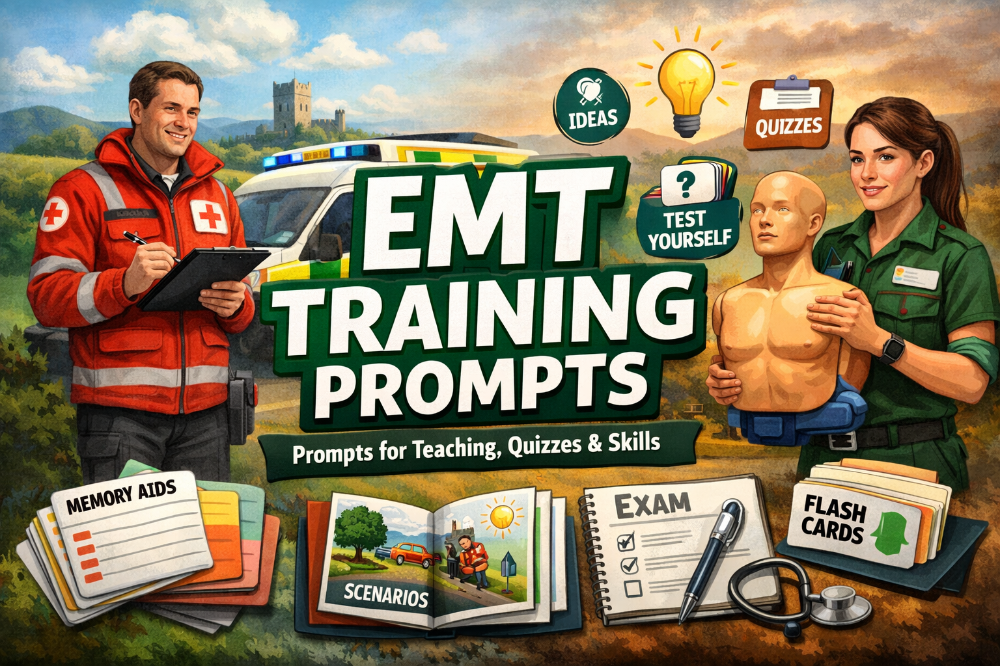

# prompts
Some Prompts to help with teaching & training

## Training Prompts
Some prompts that can help you on a daily basis

### Daily Scenario
Will simulate a scenario, that you can use to test yourself there are some optional aspects and allows you to reflect on your performance
[Prompt](docs\training\daily_scenario.md)

### Daily MCQ's
You can pick a topic amd defaults to 10 questions
[Prompt](docs\training\daily_mcq.md)

For Example you can use:
Based on the following prompt https://raw.githubusercontent.com/emt-vessels/prompts/refs/heads/main/docs/training/daily_mcq.md can you start a round of questions on medications route and dosage, can you do one by one

## Persona Prompts
You can get the AI/LLM to take on a persona to help you do different things like creating content like slides

### Training Partner
Use full to help you create content like slides, does not just create the content but guides you thru the process
[Prompt](docs\personas\teaching_partner.md)

